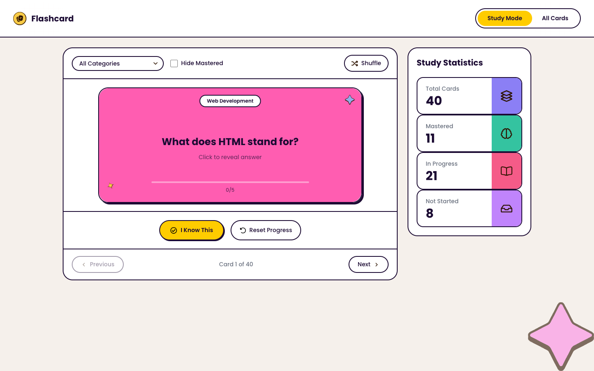
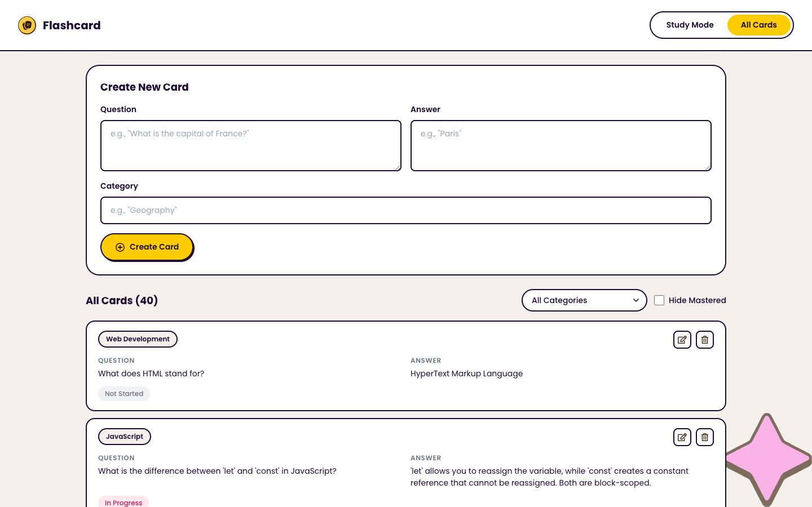
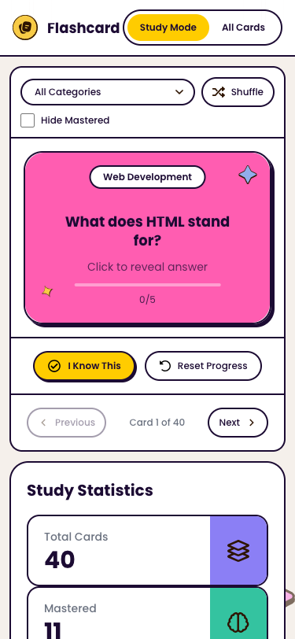
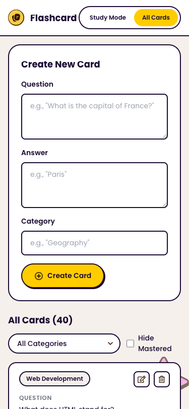

# Frontend Mentor - Flashcard App Solution

This is a solution to the [Flashcard app challenge on Frontend Mentor](https://www.frontendmentor.io/challenges/flashcard-app). Frontend Mentor challenges help you improve your coding skills by building realistic projects.

## Table of contents

- [Overview](#overview)
  - [The challenge](#the-challenge)
  - [Screenshots](#screenshots)
  - [Links](#links)
- [My process](#my-process)
  - [Built with](#built-with)
  - [What I learned](#what-i-learned)
  - [Continued development](#continued-development)
  - [AI Collaboration](#ai-collaboration)
- [Author](#author)

## Overview

### The challenge

Users should be able to:

#### Flashcard Management
- Create new flashcards with a question, answer, and category
- Edit existing flashcards to update their details
- Delete flashcards they no longer need
- See form validation messages when trying to submit a card without all fields completed
- View all their flashcards with question, answer, category, and mastery progress

#### Study Mode
- Study flashcards one at a time in Study Mode
- Click on a flashcard to flip and reveal the answer
- Mark a flashcard as known by clicking "I Know This" to track mastery progress
- Navigate between flashcards using Previous and Next buttons
- See which card they're currently viewing (e.g., "Card 1 of 40")
- Track mastery progress for each card on a scale of 0 to 5
- Reset progress to start learning all cards again

#### Filtering & Organization
- Filter flashcards by category
- Hide mastered cards to focus on cards that still need practice
- Shuffle flashcards to randomize the study order

#### Statistics & Progress
- View study statistics showing Total Cards, Mastered, In Progress, and Not Started counts

#### UI & Navigation
- Toggle between Study Mode and All Cards views
- View the optimal layout for different device screen sizes (375px, 768px, 1440px)
- See hover and focus states for all interactive elements
- Navigate the entire app using only the keyboard

### Screenshots

**Desktop (1440px)**

**Mobile (375px)**

 

### Links

- Solution URL: [Frontend Mentor Solution](https://www.frontendmentor.io/profile/gusanchefullstack)
- Live Site URL: [fsdev-flashcard-app-dev.vercel.app](https://fsdev-flashcard-app-dev.vercel.app)

## My process

### Built with

- Semantic HTML5 markup
- CSS Modules with CSS custom properties (design tokens)
- Flexbox and CSS Grid
- Responsive design (mobile-first approach)
- [React 19](https://react.dev/) — UI library
- [TypeScript](https://www.typescriptlang.org/) — type safety
- [Vite](https://vitejs.dev/) — build tool and dev server
- [Vitest](https://vitest.dev/) + [Testing Library](https://testing-library.com/) — unit and component tests
- `localStorage` — persistence across sessions

### What I learned

**CSS Modules with design tokens** — keeping all colors, spacing, typography, and shadows in a single `variables.css` file made it easy to stay consistent with the Figma design and adjust values in one place.

**Card flip animation with CSS 3D transforms** — using `transform-style: preserve-3d`, `backface-visibility: hidden`, and `rotateY(180deg)` to create a smooth flip effect without any external library.

**Custom hook for state management** — the `useFlashcards` hook encapsulates all card logic (filtering, shuffling, knownCount tracking, localStorage persistence) and keeps components clean and focused on rendering.

**Responsive filter bar** — using `flex-wrap` with explicit `flex` sizing to create a two-row layout on mobile that keeps all controls visible without overflow.

### Continued development

- Add toast notifications when cards are created, updated, or deleted
- Implement keyboard shortcuts for study mode (space to flip, arrow keys to navigate)
- Add card count per category in the filter dropdown
- Explore animations for card transitions between Previous/Next

### AI Collaboration

This project was built in collaboration with **Claude Code (Claude Sonnet 4.6)** by Anthropic.

- **Planning** — Claude helped break the challenge into phases and identify component boundaries before writing a single line of code.
- **Architecture** — designed the `useFlashcards` hook to centralize state logic and keep components presentational.
- **Implementation** — generated all React components, CSS Modules, TypeScript types, and Vitest tests.
- **Debugging** — identified and fixed responsive layout issues in the filter bar at 375px viewport.
- **What worked well** — having Claude generate boilerplate fast while I focused on reviewing design fidelity and interaction quality.

## Author

      
